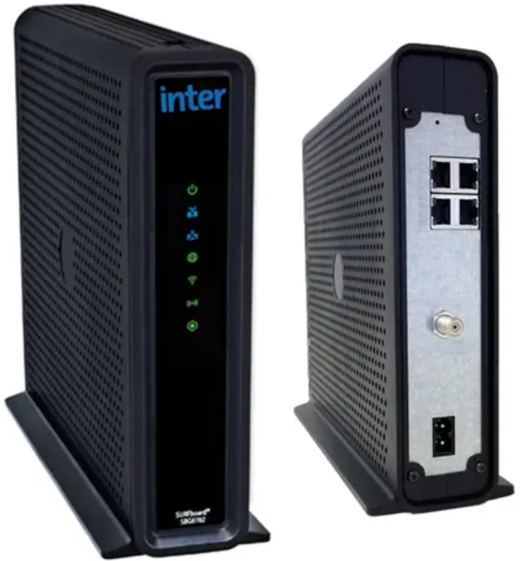

****************************************************************************************************************************************************************

General ([Shared_GatewaySettings.bin](https://github.com/ctuais/Cable-modem-Arris-Motorola-SBG6782-SBG8582/blob/9ff28528f9105f4c937690e1a04458fff1c5adda/Shared_GatewaySettings.bin)):
* Router IP: [192.168.10.2](http://192.168.10.2)
* Gateway IP: 192.168.10.1
* Login: admin / Motorola
* WAN DNS: 192.168.10.30 (local pi-hole)
* SSID: Motorola / Motorola 5G
* Cliente/Cliente: 192.168.10.10 (192.168.10.X - !192.168.10.2)
****************************************************************************************************************************************************************

English:
Hi, this is just a backup of the configuration, that I made after trying to disable the cable modem interface, but was almost no way to avoid the boot loop.

Then, I tried to get it to at least work as a router with WLAN+LAN, by making some configuration changes.

This file: "[Shared_GatewaySettings.bin](https://github.com/ctuais/Cable-modem-Arris-Motorola-SBG6782-SBG8582/blob/9ff28528f9105f4c937690e1a04458fff1c5adda/Shared_GatewaySettings.bin)", contains the configuration you need to import to settings and modify in the router's HTTP portal.

Settings to change:
Local network (DHCP, router IP)
Wi-Fi 2.4GHz / 5GHz (SSID, password...)
Login (Username / Password)
Energy Efficient Ethernet (if you're having Ethernet problems)
Basic Setup: WAN to set the DNS server IPs

If you want to connect through UART 

****************************************************************************************************************************************************************

Español:
Hola, esto es sólo una copia de la configuración que hice luego de intentar deshabilitar la interfaz de cable modem, pero no pude evitar reinicios continuos al arranque.

Entonce, intenté al menos hacer que funcionara como un Router LAN+WLAN, haciendo algunos cambios en las configuraciones.

Este archivo: "[Shared_GatewaySettings.bin](https://github.com/ctuais/Cable-modem-Arris-Motorola-SBG6782-SBG8582/blob/9ff28528f9105f4c937690e1a04458fff1c5adda/Shared_GatewaySettings.bin)", -contiene la configuración que tienes que importar desde Configuraciones y modificar en el portal HTTP del router.

Configuraciones a cambiar:
Red Local (DHCP, IP del Router)
Wi-Fi 2.4GHz / 5GHz (SSID, contraseña)
Login (usuario / contraseña)
Energy Efficient Ethernet (si notas problemas en las conexiones Ethernet)
Basic Setup: WAN para establecer las IP de los servidores DNS.

Si quieres coenctarte por UART 

****************************************************************************************************************************************************************
